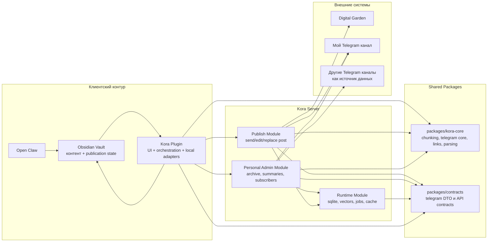
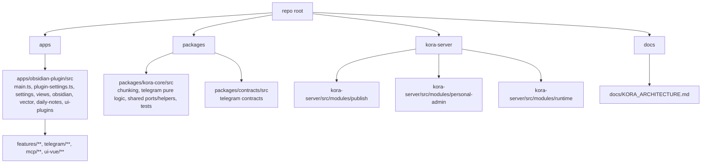

# Kora Architecture

Этот документ фиксирует итоговую архитектуру репозитория после вывода root `modules/**` из канонической схемы.

## Системная схема

## Границы ответственности

- `Vault` — главный источник истины для заметок, структуры публикации, порядка, связей между заметкой и публикацией.
- `Kora Plugin` — Obsidian-host слой: команды, настройки, views, UI, локальные адаптеры и orchestration.
- `packages/kora-core` — общий pure/shared слой без привязки к Obsidian UI и без привязки к server runtime.
- `packages/contracts` — общие DTO и API-контракты между plugin и server.
- `Kora Server` — runtime для Telegram, архива, публикации, индексации и фоновых задач.
- `Publish Module` — общий серверный слой публикации.
- `Personal Admin Module` — личный серверный слой для архива, summaries и данных канала.
- `Runtime Module` — хранилища, jobs, vector/search backend и служебная инфраструктура.

## Source Of Truth

- `Vault` хранит контент и publication state.
- `Server` не является источником истины для editorial-логики публикации.
- `Server` хранит только runtime-данные:
  - архив Telegram
  - summaries и derived artifacts
  - subscriber data
  - vector index, sqlite storage, jobs, cache, logs

## Текущий layout репозитория

## Практическое чтение структуры

- `apps/obsidian-plugin/src` — канонический plugin-side код: entrypoint, настройки, views, Obsidian adapters, feature-экраны, plugin-side Telegram, MCP и Vue UI.
- `apps/obsidian-plugin/src/features/**` — plugin-side feature-кластеры вроде related chunks и semantic inspector.
- `apps/obsidian-plugin/src/telegram/**` — plugin-side Telegram-слой: archive UI/model, transport-адаптеры и Obsidian-specific интеграции.
- `apps/obsidian-plugin/src/mcp/**` — plugin-side MCP HTTP/server/endpoints слой.
- `apps/obsidian-plugin/src/ui-vue/**` — общий Vue UI-кит плагина.
- `packages/kora-core/src` — канонический shared/core код: pure chunking, pure Telegram logic, форматирование, парсинг, links, utils и тесты core-логики.
- `packages/contracts/src` — канонические shared contracts.
- `kora-server/src/modules/*` — канонический server-side код.
- root `modules/**` больше не является архитектурным слоем и не содержит канонического кода.

## Итог phaseout `modules/**`

- plugin-side живой код разложен по `apps/obsidian-plugin/src/**`.
- feature-слой вынесен в `apps/obsidian-plugin/src/features/**`.
- plugin-side части Telegram перенесены в `apps/obsidian-plugin/src/telegram/**`.
- plugin-side MCP перенесен в `apps/obsidian-plugin/src/mcp/**`.
- общий Vue UI-kit перенесен в `apps/obsidian-plugin/src/ui-vue/**`.
- shared chunking logic и его тесты живут в `packages/kora-core/src/chunking/**`.
- shared pure Telegram logic живет в `packages/kora-core/src/telegram/**`.
- server-side `kora-server/src/modules/**` остается отдельным серверным слоем и не связан с удаленным root `modules/**`.
- Если в рабочем дереве локально еще существует пустая директория `modules/`, это больше не часть архитектуры и ее можно удалить без дополнительной миграции кода.

## Что сознательно не зафиксировано как реализованное

- Публикация для других пользователей в их каналы не реализована и не считается частью текущего результата.
- Отдельный hosted multi-tenant backend не реализован.
- `Publish Module` архитектурно отделен, но это не означает отдельный deploy или отдельный сервер.
