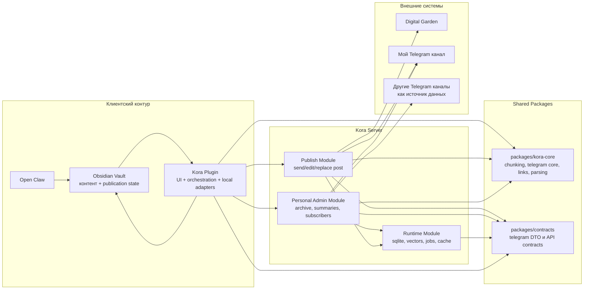
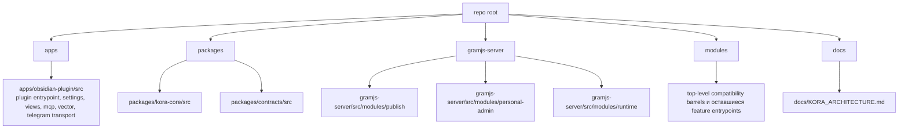

# Kora Architecture

Этот документ фиксирует итоговую архитектуру репозитория после рефакторинга.

## Системная схема

## Границы ответственности

- `Vault` — главный источник истины для заметок, структуры публикации, порядка, связей между заметкой и публикацией.
- `Kora Plugin` — Obsidian-host слой: команды, настройки, views, UI, локальные адаптеры и orchestration.
- `packages/kora-core` — общий pure/shared слой без привязки к Obsidian UI и без привязки к server runtime.
- `packages/contracts` — общие DTO и API-контракты между plugin и server.
- `Kora Server` — runtime для Telegram, архива, публикации, индексации и фоновых задач.
- `Publish Module` — общий серверный слой публикации.
- `Personal Admin Module` — личный серверный слой для архива, summaries и данных канала.
- `Runtime Module` — хранилища, jobs, vector/search backend и служебная инфраструктура.

## Source Of Truth

- `Vault` хранит контент и publication state.
- `Server` не является источником истины для editorial-логики публикации.
- `Server` хранит только runtime-данные:
  - архив Telegram
  - summaries и derived artifacts
  - subscriber data
  - vector index, sqlite storage, jobs, cache, logs

## Текущий layout репозитория

## Практическое чтение структуры

- `apps/obsidian-plugin/src` — канонический plugin-side код.
- `packages/kora-core/src` — канонический shared/core код.
- `packages/contracts/src` — канонические shared contracts.
- `gramjs-server/src/modules/*` — канонический server-side код.
- `modules/**` — переходный слой. Внутри него теперь в основном остались top-level barrels для совместимости и те feature-модули, которые еще канонически живут в `modules`.

## Что осталось в `modules`

- `modules/chunking/**`, `modules/semantic-inspector/**`, `modules/hosts/**`, `modules/telegram/archive/**`, `modules/telegram/utils/**`, `modules/mcp/endpoints/**` — это все еще живые feature-модули, а не shim-слой.
- `modules/obsidian/index.ts`, `modules/ui-plugins/index.ts`, `modules/vector/index.ts`, `modules/daily-notes/index.ts`, `modules/mcp/index.ts`, `modules/telegram/transport/index.ts`, `modules/telegram/ui/index.ts` — это совместимые top-level entrypoint/barrel-файлы.
- Удалены промежуточные subpath-shim файлы вроде `modules/vector/vector-bridge.ts` или `modules/obsidian/file-operations.ts`: app-слой и feature-код теперь ходят либо в `apps/**`, либо в top-level barrels, либо прямо в канонические feature-модули.

## Что сознательно не зафиксировано как реализованное

- Публикация для других пользователей в их каналы не реализована и не считается частью текущего результата.
- Отдельный hosted multi-tenant backend не реализован.
- `Publish Module` архитектурно отделен, но это не означает отдельный deploy или отдельный сервер.
