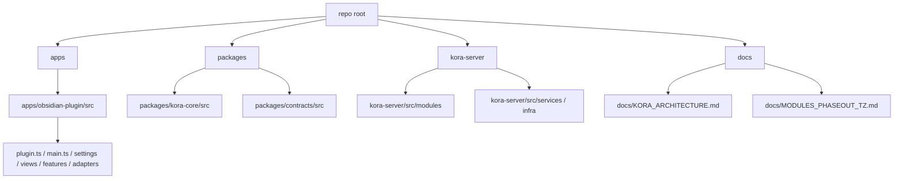

# ТЗ: финальный вывод root `modules/**` из архитектуры

Этот документ описывает целевую конечную архитектуру репозитория и план отдельной сессии, задача которой — убрать root `modules/**` как самостоятельный архитектурный слой.

## Контекст

Текущий репозиторий уже приведен к промежуточной целевой архитектуре:

- `apps/obsidian-plugin/src/**` — канонический plugin/app слой
- `packages/kora-core/src/**` — shared core
- `packages/contracts/src/**` — shared contracts
- `kora-server/src/**` — server runtime
- `modules/**` — смешанный слой:
  - часть файлов уже удалена как промежуточные compatibility shims
  - часть top-level `index.ts` оставлена как совместимые entrypoint/barrel-файлы
  - часть feature-кода все еще канонически живет в `modules/**`

Цель следующего большого этапа — довести архитектуру до состояния, где root `modules/**` больше не нужен как отдельный слой.

## Главная цель

Полностью убрать root `modules/**` из конечной архитектуры, не теряя feature-декомпозицию и не меняя пользовательское поведение.

Важно:

- не добавлять новые фичи
- не переписывать существующую бизнес-логику без необходимости
- не ломать текущие рабочие сценарии
- не смешивать plugin-only, shared и server-only код

## Что считается успехом

Успехом считается состояние, в котором:

- весь plugin-only код живет в `apps/obsidian-plugin/src/**`
- весь shared pure code живет в `packages/kora-core/src/**`
- все shared contracts живут в `packages/contracts/src/**`
- весь server-only код живет в `kora-server/src/**` или в будущем в `kora-server/src/**`
- директория `modules/**` либо полностью удалена, либо сведена к временному пустому слою, который можно удалить без дополнительных переносов

## Что не входит в задачу

- не реализовывать новые product-фичи
- не делать multi-tenant backend
- не добавлять публикацию для других пользователей
- не перепроектировать Telegram flows ради красоты
- не менять source of truth: `Vault` остается источником истины для контента и publication state

## Целевая конечная схема



## Желаемое дерево репозитория

```text
apps/
  obsidian-plugin/
    src/
      main.ts
      plugin-settings.ts
      obsidian/
      settings/
      views/
      mcp/
      vector/
      telegram/
        transport/
        formatting/
        parsing/
        archive/
        utils/
      features/
        chunking/
        semantic-inspector/
        hosts/
      ui-plugins/
      daily-notes/

packages/
  kora-core/
    src/
      chunking/
      telegram/
      ...
  contracts/
    src/
      telegram.ts

kora-server/
  src/
    modules/
      publish/
      personal-admin/
      runtime/

docs/
  KORA_ARCHITECTURE.md
  MODULES_PHASEOUT_TZ.md
```

## Архитектурное правило для переноса

Каждый перенос проверяется одним вопросом:

- `Этот код зависит от Obsidian App, Plugin, View, Vault, Notice, UI или команд?`
  - да: переносить в `apps/obsidian-plugin/src/**`
  - нет: проверять, является ли это shared pure logic
- `Это pure/domain/helper logic без зависимости на plugin runtime и server runtime?`
  - да: переносить в `packages/kora-core/src/**`
  - нет: проверять, относится ли код к серверу
- `Этот код нужен только серверу, Telegram runtime, sqlite, jobs, API routes?`
  - да: держать в `kora-server/src/**`

## Предлагаемые фазы следующей сессии

### Фаза 1. Инвентаризация живого `modules/**`

Нужно составить точную карту того, что еще реально живет в `modules/**`.

Ожидаемый результат:

- список папок, которые все еще содержат канонический код
- список оставшихся top-level barrels
- список импортов, которые еще смотрят в `modules/**`

Кандидаты на перенос в первую очередь:

- `modules/chunking/**`
- `modules/semantic-inspector/**`
- `modules/hosts/**`
- `modules/telegram/archive/**`
- `modules/telegram/utils/**`
- `modules/mcp/endpoints/**`

### Фаза 2. Перенос plugin-side feature модулей

Перенести в `apps/obsidian-plugin/src/features/**` те feature-кластеры, которые завязаны на Obsidian/plugin runtime.

Приоритет:

1. `modules/chunking/**`
2. `modules/semantic-inspector/**`
3. `modules/hosts/**`
4. `modules/telegram/archive/**`
5. `modules/telegram/utils/**`, если они реально plugin-side

После каждого переноса:

- обновить импорты на новый путь
- сохранить поведение
- временно оставить минимальный compatibility barrel только если он действительно нужен

### Фаза 3. Доперенос pure логики в `packages/kora-core`

Во время переноса feature-кластеров может обнаружиться код, который не должен жить в plugin app-слое.

Его нужно отдельно вытаскивать в `packages/kora-core/src/**`, если это:

- pure formatting
- pure parsing
- pure state/model logic
- reusable interfaces/ports/helpers

### Фаза 4. Разделение MCP на plugin-side и shared/server-side

`modules/mcp/**` нужно аккуратно разобрать по назначению:

- plugin runtime pieces — в `apps/obsidian-plugin/src/mcp/**`
- shared contracts/helpers — в `packages/**`
- серверные/endpoint-oriented части — оставить в своем явном слое до появления отдельного `kora-server`

Критерий успеха этой фазы:

- нет “сиротских” mcp-файлов в root `modules/**`, происхождение которых непонятно

### Фаза 5. Удаление top-level barrels и удаление `modules/**`

Когда все живые feature-модули будут перенесены:

- удалить оставшиеся top-level barrels
- убедиться, что ни один внутренний импорт не смотрит в `modules/**`
- удалить директорию `modules/**`

## Ограничения на реализацию

- не добавлять новую пользовательскую функциональность
- не менять shape настроек без необходимости
- не ломать существующие команды Obsidian
- не ломать Telegram sync
- не ломать archive view
- не ломать related chunks / semantic inspector
- не трогать кириллицу и пользовательские строки без необходимости
- если в комментариях/JSDoc нужен новый текст, писать его по-русски

## Проверка после каждого подэтапа

Минимальная техническая проверка:

1. `node esbuild.config.mjs production`
2. `npm run build`

Минимальный ручной smoke-test:

1. Перезагрузить плагин в Obsidian
2. Открыть `Settings -> Kora`
3. Проверить вкладки `Telegram`, `Archive`, `Vector`, `MCP Server`, `UI Plugins`
4. Открыть:
   - `Open Related Chunks`
   - `Open Semantic Inspector`
   - `Open Telegram Archive`
5. Выполнить `Sync note list to Telegram (position-based)` на уже рабочем тестовом списке

## Важный принцип миграции

Если выбор стоит между:

- “быстро удалить старый слой”
- “сначала явно разложить ownership кода”

нужно выбирать второй вариант.

Итоговая цель не в том, чтобы просто исчезла папка `modules`, а в том, чтобы:

- plugin-side код имел plugin-side дом
- shared code имел shared дом
- server-side код имел server-side дом

Только после этого удаление `modules/**` будет правильным, а не косметическим.
