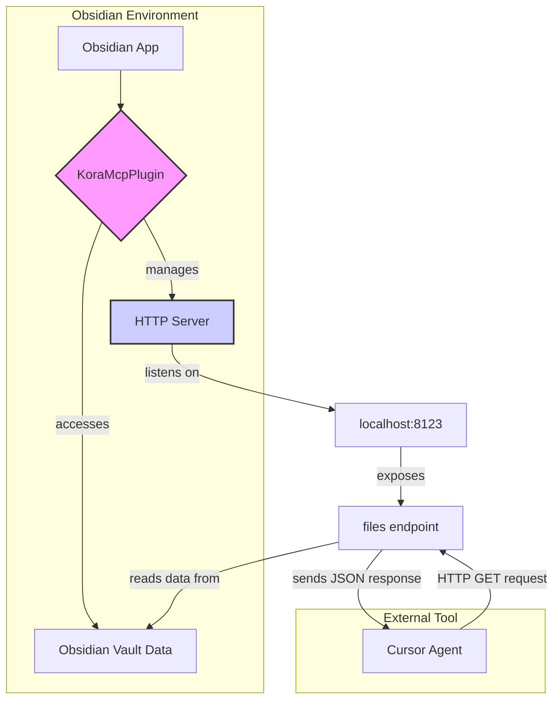

# Architecture of Kora MCP Server

This document describes the architecture of the Kora MCP (Meta-Command-Prompt) Server, which is implemented as an Obsidian plugin. The server provides a local HTTP API to interact with your Obsidian vault's data.

## Overview

The Kora MCP Server follows a simple client-server model:

*   **Server**: The Obsidian plugin (`KoraMcpPlugin`) runs a lightweight HTTP server directly within Obsidian.
*   **Client**: Any application capable of making HTTP requests (like Cursor, a script, or a web browser) can act as a client to access the vault's data through the defined API endpoints.

This setup allows external tools to programmatically access and interact with your notes without needing to understand the complexities of the Obsidian API or the vault's file structure on disk.

### Mermaid Diagram: System Architecture

## How It Works

### 1. Plugin Lifecycle (`main.ts`)

The core logic is contained within `obsidian-kora/main.ts`.

*   **`onload()`**: When the plugin is enabled, this method is called. It performs the following actions:
    *   Loads the plugin settings (e.g., the server port).
    *   Calls `startServer()` to initialize and run the HTTP server.
    *   Registers a command to restart the server manually.

*   **`onunload()`**: When the plugin is disabled, this method calls `stopServer()` to gracefully shut down the HTTP server, releasing the port and cleaning up resources.

### 2. HTTP Server (`startServer()`)

The `startServer()` method uses Node.js's built-in `http` module to create the server.

*   **Creation**: `http.createServer()` sets up a new server instance.
*   **Listening**: `server.listen(port, ...)` binds the server to the IP address `127.0.0.1` and the configured port (default is `8123`). Listening on `127.0.0.1` (localhost) ensures that the server is only accessible from your local machine, which is crucial for security.
*   **Error Handling**: The server listens for the `error` event. If the port is already in use (`EADDRINUSE`), it notifies the user.

### 3. API Endpoint (`GET /files`)

The server currently has a single endpoint:

*   **Endpoint**: `GET /files`
*   **Functionality**: When a `GET` request is received at this URL, it uses the Obsidian API (`this.app.vault.getMarkdownFiles()`) to get a list of all markdown files in the vault.
*   **Response**: It then formats this list into a JSON array, where each object contains the file's `path`, `basename`, and `stat` (file statistics like size and modification time). This JSON array is sent back to the client with a `200 OK` status code.
*   **CORS**: The server includes `Access-Control-Allow-Origin: *` in the response headers. This is a CORS (Cross-Origin Resource Sharing) header that allows web pages from any origin to request resources from this server. This is important for tools like Cursor that might make requests from a browser-like environment.

## Connecting Cursor to the MCP Server

To allow a Cursor agent to access the files from your vault, you need to tell it about this new data source. In Cursor, you can often add custom tools or commands.

While the exact method for adding a custom tool to Cursor can vary, the general approach is to define a new tool that makes an HTTP request to your local server.

Here is a conceptual example of how you might define such a tool for Cursor:

1.  **Define a new tool** within Cursor's configuration. Let's call it `getObsidianFiles`.
2.  **Specify the action** for this tool: it should make an HTTP `GET` request.
3.  **Set the URL**: The request URL will be `http://127.0.0.1:8123/files`. You need to ensure the port matches the one configured in the Kora MCP Plugin settings in Obsidian.
4.  **No parameters needed** for this simple command.
5.  **Describe the output**: The tool should expect a JSON response containing a list of file objects.

Once configured, you could instruct the Cursor agent: "@getObsidianFiles list all notes" or similar, and the agent would trigger the tool, call your local server, and get the list of files from your Obsidian vault.

---

This documentation should provide a clear starting point for understanding and extending the Kora MCP Server. 